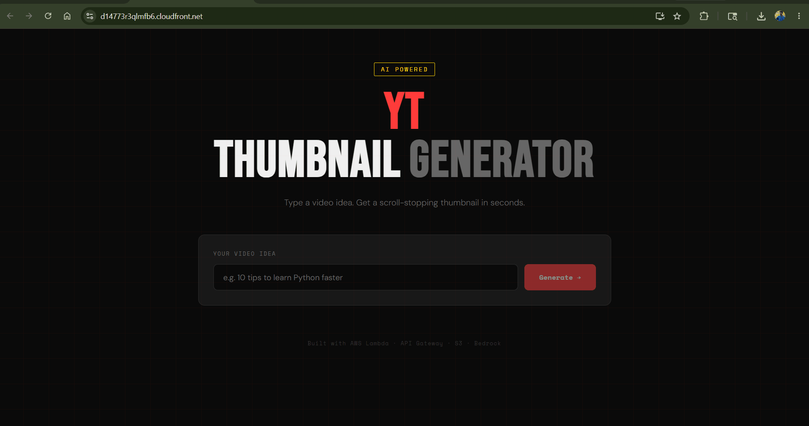
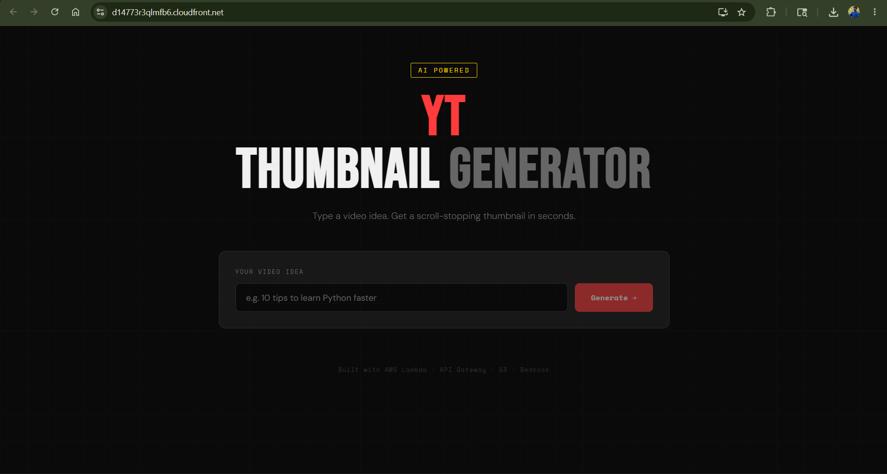
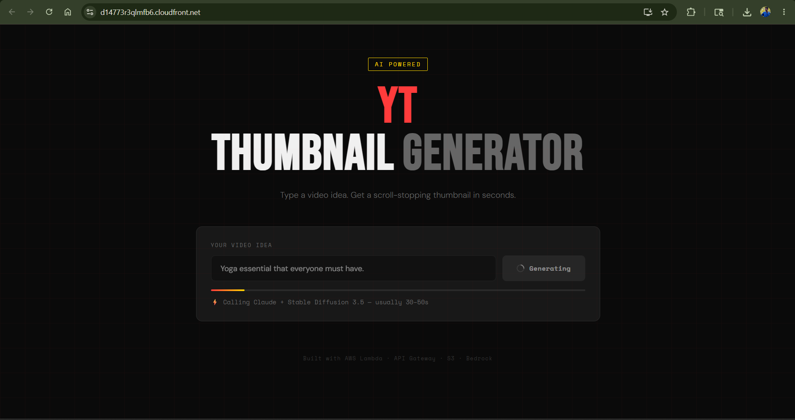
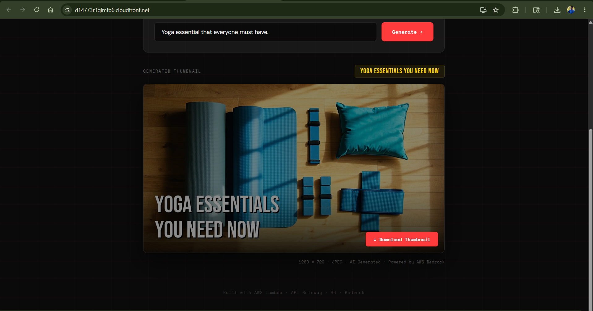
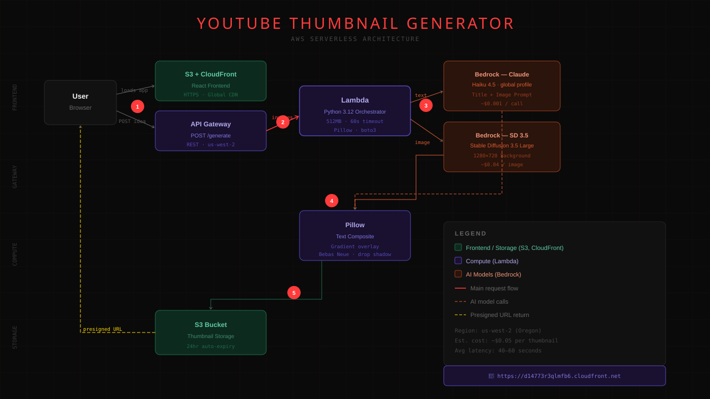

# 🎬 YouTube Thumbnail Generator

> An AI-powered thumbnail generator that turns a video idea into a scroll-stopping YouTube thumbnail in under 60 seconds — built entirely on AWS serverless infrastructure.

**🔗 Live Demo:** [https://d14773r3qlmfb6.cloudfront.net](https://d14773r3qlmfb6.cloudfront.net)


---



### App Screenshots

| Home Page | Generating | Output Ready | Final Thumbnail |
|---|---|---|---|
|  |  |  |  |

---

## What It Does

Type a video idea like *"10 tips to learn Python faster"* and the app:

1. Uses **Claude Haiku 4.5** to generate a punchy thumbnail title and cinematic image prompt
2. Uses **Stable Diffusion 3.5 Large** to generate a high-quality background image
3. Composites bold title text onto the image using **Pillow**
4. Stores the result in **S3** and returns a download link — all in under 60 seconds

---

## Architecture

```
User → React (S3 + CloudFront)
     → API Gateway (REST)
     → Lambda (Python orchestrator)
          → Bedrock: Claude Haiku 4.5             (title + image prompt)
          → Bedrock: Stable Diffusion 3.5 Large   (background image)
          → Pillow                                 (text composite)
          → S3                                     (store + presigned URL)
```



---

## Tech Stack

| Layer | Service | Purpose |
|---|---|---|
| Frontend | React + S3 + CloudFront | Single page app, HTTPS, global CDN |
| API | API Gateway (REST) | Single POST /generate endpoint |
| Backend | AWS Lambda (Python 3.12) | Serverless orchestration |
| AI — Text | Bedrock Claude Haiku 4.5 | Title generation + image prompt |
| AI — Image | Bedrock Stable Diffusion 3.5 Large | Background image generation |
| Image Processing | Pillow | Text overlay + gradient composite |
| Storage | S3 | Thumbnail storage with 24hr auto-expiry |

---

## How It Works

### Step 1 — Text Generation (Claude Haiku)

Lambda sends the video idea to Claude Haiku via the Bedrock `InvokeModel` API. Claude returns a JSON object with a punchy ALL-CAPS title (max 6 words) and a detailed Stable Diffusion image prompt.

### Step 2 — Image Generation (Stable Diffusion 3.5 Large)

The image prompt is sent to SD3.5 Large via Bedrock. The model returns a base64-encoded 1280x720 image optimised for YouTube thumbnail dimensions.

### Step 3 — Pillow Composite

Lambda uses Pillow to:
- Open the generated image
- Apply a dark gradient overlay at the bottom third (for text legibility)
- Render the title in Bebas Neue font with a drop shadow
- Export the final image as JPEG at 92% quality

### Step 4 — S3 Storage + Presigned URL

The final JPEG is uploaded to S3 under `thumbnails/`. A presigned URL valid for 24 hours is generated and returned to the frontend. A lifecycle rule auto-deletes all objects after 24 hours to keep costs near zero.

---

## Project Structure

```
youtube-thumbnail-generator/
│
├── backend/
│   ├── lambda_function.py   # Lambda handler + Bedrock + Pillow logic
│   └── requirements.txt     # Python dependencies
│
├── frontend/
│   ├── src/
│   │   ├── App.js           # React app
│   │   └── App.css          # Styles
│   └── .env.example         # Environment variable template
│
├── docs/
│   ├── architecture.svg
│   ├── Thumbnail_genarator_demo.gif
│   ├── Thumbnail_genarator_Home_Page.png
│   ├── Thubnai_genarator_genaration_progress.png
│   ├── Genrated_Downloadable_OutPut.png
│   └── Final_genrated_thumbnail.png
│
├── .gitignore
└── README.md
```

---

## Local Setup

### Prerequisites
- AWS account with Bedrock access (Claude Haiku 4.5 + SD3.5 Large)
- Node.js 18+
- Python 3.12
- Docker (for packaging Pillow for Lambda)

### Backend Deployment

```bash
# 1. Package Pillow for Amazon Linux
docker run --rm --entrypoint pip \
  -v "$PWD/backend:/var/task" \
  public.ecr.aws/lambda/python:3.12 \
  install Pillow==10.3.0 -t /var/task/package/

# 2. Copy source files
cp backend/lambda_function.py backend/package/
cp BebasNeue-Regular.ttf backend/package/

# 3. Zip and deploy
cd backend/package && zip -r ../../lambda.zip . && cd ../..
```

Then upload `lambda.zip` to AWS Lambda with these settings:
- Runtime: Python 3.12 / Architecture: x86_64
- Memory: 512 MB / Timeout: 60s
- Environment variable: `THUMBNAIL_BUCKET=your-bucket-name`

### Frontend Deployment

```bash
# 1. Set your API URL
cp frontend/.env.example frontend/.env
# Edit .env: REACT_APP_API_URL=https://your-api-gateway-url/prod/generate

# 2. Build
cd frontend && npm install && npm run build

# 3. Deploy to S3
aws s3 sync build/ s3://your-frontend-bucket --delete
```

---

## Cost Breakdown

| Service | Free Tier | Cost Beyond Free Tier |
|---|---|---|
| Lambda | 1M requests/month | ~$0.0000002/request |
| API Gateway | 1M calls/month | ~$3.50/million |
| S3 | 5GB storage | ~$0.023/GB |
| CloudFront | 1TB transfer/month | ~$0.0085/GB |
| Bedrock — Claude Haiku | No free tier | ~$0.001/call |
| Bedrock — SD3.5 Large | No free tier | ~$0.04/image |

**Estimated cost for 100 thumbnails: ~$4.50**

---

## IAM Permissions Required

Lambda execution role needs:

```json
{
  "Actions": [
    "bedrock:InvokeModel",
    "s3:PutObject",
    "s3:GetObject",
    "logs:CreateLogGroup",
    "logs:CreateLogStream",
    "logs:PutLogEvents"
  ]
}
```

---

## Future Improvements

- [ ] Custom font upload — let users bring their own branding
- [ ] Multiple thumbnail variations per idea (A/B testing)
- [ ] Title style options (clickbait, educational, listicle)
- [ ] User history — save and revisit past thumbnails
- [ ] Batch generation for content calendars
- [ ] CloudFront signed URLs for private access control

---

## Author

**Ankit** — AI Infrastructure & Cloud Engineer transitioning into AI Product Management

[](https://linkedin.com/in/your-profile)
[](https://github.com/Ankit-2024)
